# Adaptive AI Trading System (FOSS Edition)

A professional-grade, self-optimizing multi-agent trading system built with **Python**, **Docker**, **Supabase**, and **DuckDuckGo**. Designed for 24/7 continuous operation with zero ongoing API costs (excluding trading commissions).

## 🚀 Features

- **Multi-Agent Architecture**:
  - **Strategist**: Makes high-level decisions based on aggregated data.
  - **Quant Researcher**: Self-optimizes technical parameters (RSI, SMA, MACD) using `vectorbt` backtesting.
  - **Sentiment Analyst**: Analyzes news sentiment using `DuckDuckGo` and `FinBERT`.
  - **Risk Manager**: Enforces stop-losses, position sizing, and circuit breakers.
  - **Executor**: Smart order execution via Alpaca (Limit orders in extended hours).

- **FOSS Stack (Free & Open Source)**:
  - **News**: DuckDuckGo (No API Keys).
  - **Database**: Supabase Free Tier (PostgreSQL in Cloud).
  - **Deployment**: Docker Containerized.

- **Advanced capabilities**:
  - **Extended Hours Trading**: Automatic limit order switching.
  - **Continuous Loop**: Runs 24/7 with sleep cycles and error recovery.
  - **Persistence**: Logs every trade to Supabase Cloud.

## 🛠️ Architecture

```mermaid
graph TD
    %% Styling
    classDef agent fill:#e1f5fe,stroke:#01579b,stroke-width:2px;
    classDef brain fill:#e8f5e9,stroke:#2e7d32,stroke-width:2px;
    classDef infra fill:#fff3e0,stroke:#ef6c00,stroke-width:2px;
    classDef external fill:#f3e5f5,stroke:#7b1fa2,stroke-width:2px;
    classDef future fill:#f5f5f5,stroke:#9e9e9e,stroke-width:2px,stroke-dasharray: 5 5;

    %% External Data/APIs
    subgraph External["🌍 External Ecosystem"]
        MarketData[("Alpaca / YFinance")]:::external
        NewsSource[("DuckDuckGo / NewsAPI")]:::external
        LLMs[("Examples: Gemini 2.0 / Groq")]:::external
        Discord[("Discord Webhook")]:::external
    end

    %% Infrastructure & Persistence
    subgraph Infra["🏗️ Infrastructure"]
        Supabase[(Supabase PostgreSQL)]:::infra
        Dashboard["Streamlit Dashboard"]:::infra
    end

    %% The Brain (LangGraph)
    subgraph AgentSwarm["🤖 Agent Swarm (LangGraph)"]
        direction TB
        
        %% Entry
        Start((Start)) --> Supervisor{Supervisor Agent}:::agent
        
        %% Analysts Layer (Parallel)
        Supervisor -->|Route| TechAgent[Technical Analyst]:::agent
        Supervisor -->|Route| SentAgent[Sentiment Analyst]:::agent
        Supervisor -->|Route| MacroAgent[Macro Analyst]:::agent
        Supervisor -->|Route| ResearchAgent[News Researcher]:::agent
        
        %% Phase 6 Placeholder
        Supervisor -.->|Future| MLForecaster[ML Forecaster]:::future
        
        %% Reasoning Layer
        TechAgent --> Strategist
        SentAgent --> Strategist
        MacroAgent --> Strategist
        ResearchAgent --> Strategist
        MLForecaster -.-> Strategist
        
        Strategist[Strategist Agent]:::brain
        
        %% Risk & Execution
        Strategist -->|Signal| RiskAgent[Risk Manager]:::agent
        RiskAgent -->|Approved| Executor[Executor Agent]:::agent
        RiskAgent -->|Rejected| End((End))
        Executor --> End
    end

    %% Data Flows
    MarketData --> TechAgent
    MarketData --> MacroAgent
    NewsSource --> SentAgent
    NewsSource --> ResearchAgent
    
    Strategist -->|Inference| LLMs
    ResearchAgent -->|Synthesis| LLMs
    
    %% Persistence & Obs
    AgentSwarm -->|Checkpoints| Supabase
    AgentSwarm -->|Alerts| Discord
    Dashboard -->|Read| Supabase

    %% Detailed Connections
    TechAgent --"RSI, MACD"--> Strategist
    SentAgent --"FinBERT Score"--> Strategist
    MacroAgent --"VIX, Sector"--> Strategist
    ResearchAgent --"Deep Dive Report"--> Strategist
```



## 📦 Installation

### Prerequisites
- Docker & Docker Compose
- Python 3.11+
- Supabase Account (Free)
- Alpaca Paper Trading Account

### 1. Clone & Setup
```bash
git clone https://github.com/kaushikkumarkr/Trading.git
cd Trading
cp trading_system/.env.example trading_system/.env
```

### 2. Configure Environment
Edit `trading_system/.env` with your keys:
```bash
# Alpaca (Trading)
ALPACA_API_KEY=...
ALPACA_SECRET_KEY=...

# Google (LLM Brain)
GOOGLE_API_KEY=...

# Supabase (Database)
SUPABASE_URL=...
SUPABASE_KEY=...
```

### 3. Initialize Database
Copy the SQL from `trading_system/database/schema.sql` and run it in your Supabase SQL Editor.

## 🏃‍♂️ Usage

### Docker (Recommended)
```bash
docker-compose up --build
```

### Local (Dev)
```bash
python -m venv venv
source venv/bin/activate
pip install -r trading_system/requirements.txt
python -m trading_system.main
```

## 🧪 Verification
The system includes verification scripts to test all components:
- `verify_alpaca.py`: Test broker connection.
- `verify_google.py`: Test LLM connection.
- `verify_supabase.py`: Test database write/read.

## 📝 License
MIT
